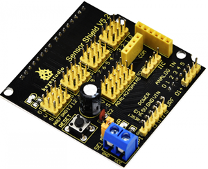
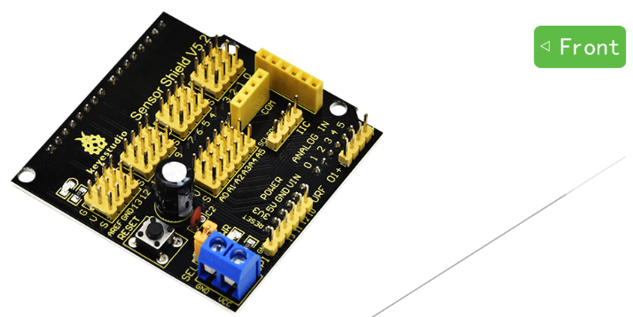
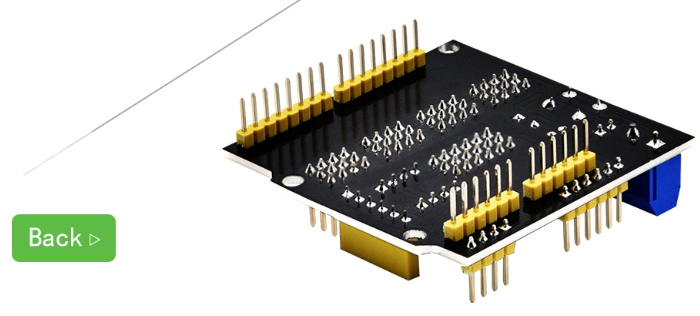
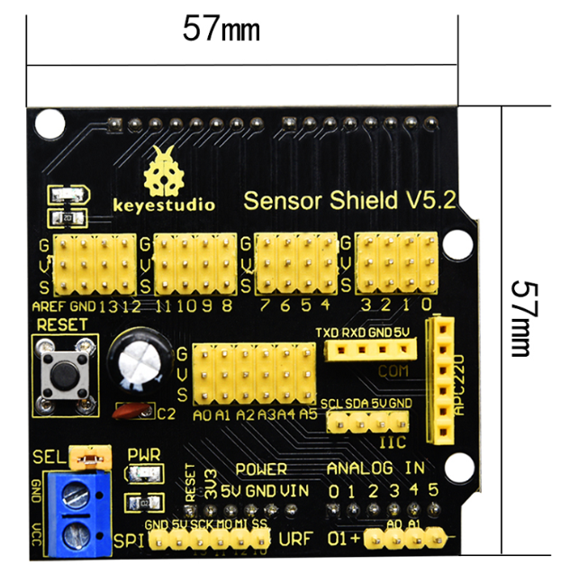
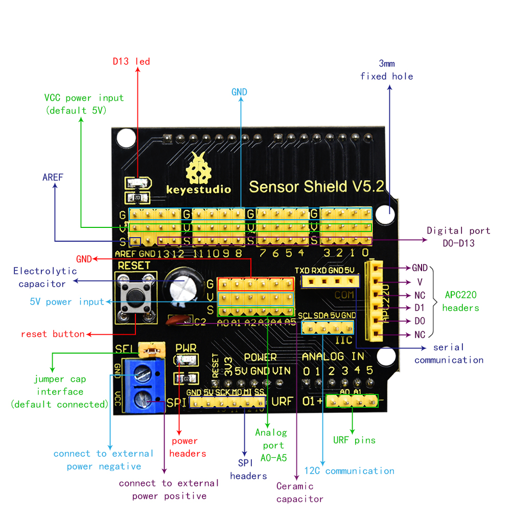
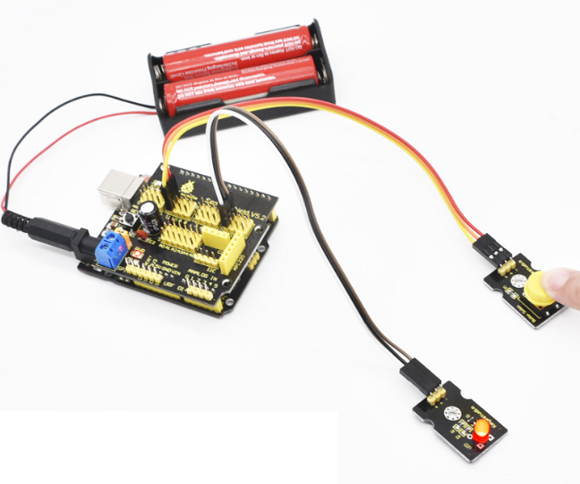

# KS0004 keyestudio Sensor Shield V5

## 1. Introduction

In the experiments, you might often use UNO R3 control board and several sensor modules. If the interfaces of power output is not enough, you may need to add a breadboard and use many connection wires. Is it really troublesome？

But now, with this keyestudio sensor shield, you can easily solve that problem. This shield is fully compatible with UNO R3 control board, so you can easily stack it onto UNO R3 for use.

This keyestudio sensor shield has extended the digital and analog ports out as 3PIN interface (G,V, S), which can directly connect 3PIN sensor modules.

It also breaks out some communication pins of 2.54mm pitch, like serial, IIC, and SPI communication.

The shield comes with a reset button and 2 signal indicators as well.

Additionally, you can supply the voltage needed to the sensor modules through blue terminal blocks on the shield. Because some sensor modules is not used with 5V or 3.3V but with special voltage.

## 2. Check out specifications

- Extends an Arduino Reset button
- Comes with a built-in power indicator and a D13 indicator
- Breakout all the digital and analog ports of UNO R3 as 3PIN headers
- A serial communication interface
- A I2C communication interface
- A SPI communication interface
- Comes with a URF interface
- Comes with an APC220 interface
- You can supply the voltage needed for sensor modules via terminal blocks.

## 3. Controllers Compatible

- keyestudio UNO R3 BOARD/Arduino UNO R3
- keyestudio EASY plug Control Board
- keyestudio Leonardo R3 Development Board
- 51duino

## 4. Details

- Dimensions: 57mm x 57mm x 20mm
- Weight: 20.5g

## 5. Pinout Instructions

**Note:**
When SE is connected with jumper cap, and input DC 7V to VCC /GND terminal block, so the voltage of V, V1 and + pins are 7V.

When SE is connected with jumper cap, and VCC /GND terminal block without voltage input, shield is powered via UNO R3, so the voltage of V, V1 and + pins are 5V.

When SE is disconnected, input DC 7V to VCC /GND terminal block, so the voltage of V pin is 7V, the voltage of V1 and + pins are 0V.

When SE is disconnected, and VCC /GND terminal block without voltage input, shield is powered via UNO R3, so the voltage of V pin is 0V, the voltage of V1 and + pins are 5V.

## 6. Example Use

You can stack the shield onto UNO R3 board. Use a PIR motion sensor and LCD display to build the circuit experiments.

